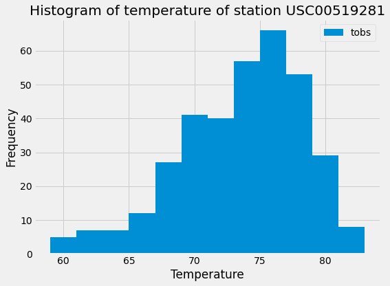

In this activity, I'll explore the weather data of Hawaii. The data is store in SQLite Database. The data is queried using SQLAlchemy ORM in Python. 

## Precipitation Analysis

- Use SQLAlchemy create_engine to connect to your sqlite database.
- Use SQLAlchemy automap_base() to reflect your tables into classes and save a reference to those classes called Station and Measurement.
- Design a query to retrieve the last 12 months of precipitation data (excluding NULL value)
- Load the query results into a Pandas DataFrame and set the index to the date column.
- Sort the DataFrame values by date.
- Plot the results using the DataFrame plot method.

## Station Analysis ##
- Design a query to retrieve the last 12 months of temperature observation data (TOBS).
- Filter by the station with the highest number of observations.
- Plot the results as a histogram with bins=12.

## Temperature Analysis
Hawaii is reputed to enjoy mild weather all year. Is there a meaningful difference between the temperature in, for example, June and December? The answe is Yes.t-test shows p-value <0.05, thus we can conclude there is a statistical significant different between mean temperature of June and December.

## Daily Temperature Normals

